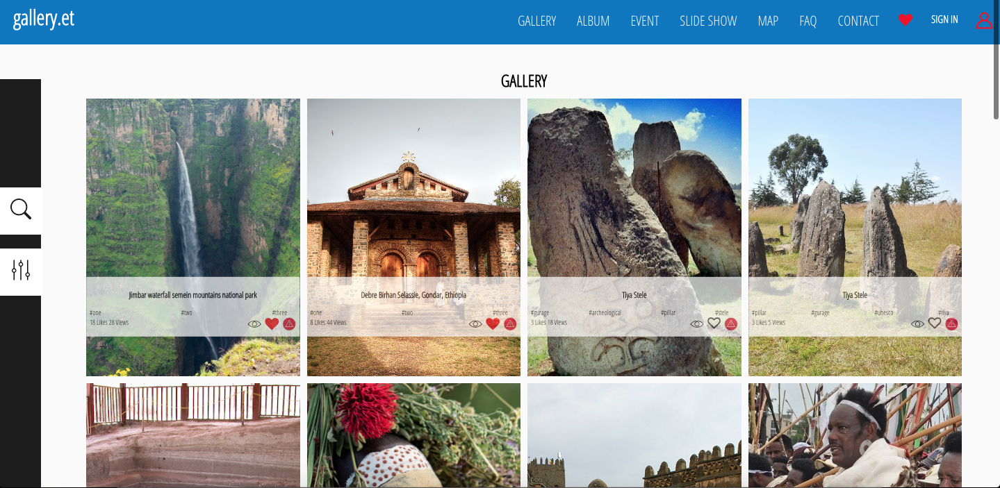
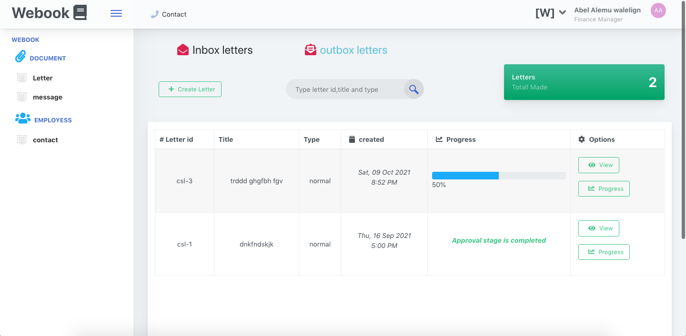
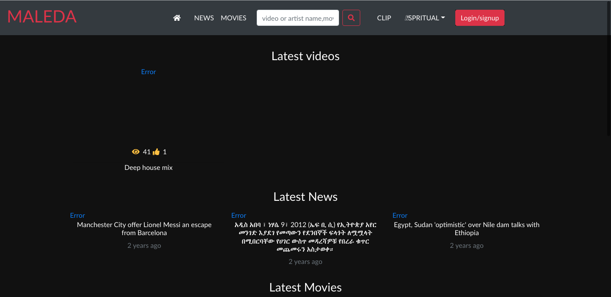
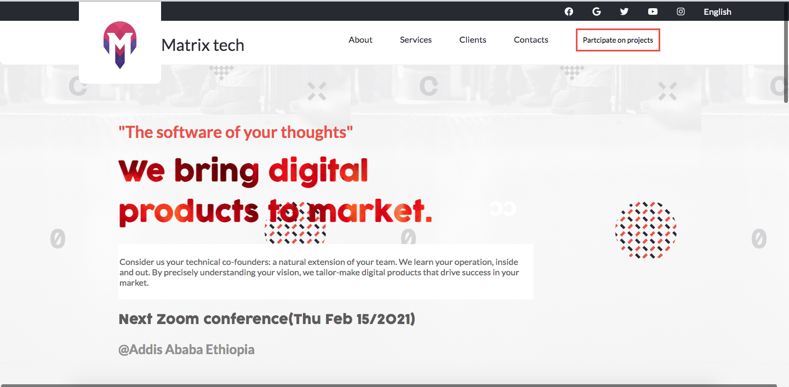

### Hi there 👋, I am Dagmawi zewdu.you can call me Dagi.

 
<h2 align= "center">🛠 Tech Stack  </h2>

 
 

- 🔭 I’m currently working on local freelancing sites and Also private company.

- 🌱 And also I’m currently learning on [Microverse](https://www.microverse.org/).To further improve my skills.  
  
- 👯 I’m looking to collaborate on opensource projects.

  

- 📫 You can reach me on :

  > 📱 whatsapp,telegram(+251910565994)
  > ✉️ dagi.zewdu.dz@gmail.com
<h1 align="center">Projects</h1>
<table bordercolor="#66b2b2">
  
  <tr>
    <td width="33%" valign="top">
      <h3>Gallery</h3>
         
      

  
        

         
        
        
<strong>Javascript,React,styled.js, Node.js, & Express.js</strong> - 
        shows the nature and awesome images in ethiopia !

    </td>
    <td width="33%" valign="top">
      <h3>Webook</h3>
         
        

          
  
  
      

         
        
        
<strong>Mern stack(Mongo db,express,react and Node.js)</strong>  
        Makes easy communication easy for companies .Like easy way of writing leter and also messages. You can test using employee id=> 123 and password=> 123. and after url loads. try to refresh the page. It doesn't show any content when it is reload on the first time. 
        

    </td>
  </tr>
  
  <tr>
    <td width="33%" valign="top">
      <h3>Maleda : video streaming sites</h3>
         
        

  
  
      

         
        
        
<strong>React and javascript<strong>  
      - Videos straming app and used to read news

    </td>
    <td width="33%" valign="top">
      <h3>Metrix tech website(under construction)</h3>
         
        

          
  
  
      

         
        
        
<strong>HTML5, CSS3, & Javascript</strong> - 
         This website is for metrix tech company and used as a portifolio.
        !

    </td>
  </tr>
</table>
- ⚡ Fun fact:
  > ☕ 1430 cups of coffee,
  > ⏱️ 10,200 hours of coding
